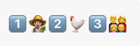
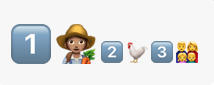
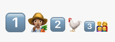
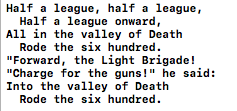

# Swift4新特性
> 摘录来自: By the raywenderlich.com Tutorial Team. “iOS 11 by Tutorials”。

## One-sided ranges
```swift
“let esports = ["Hearthstone", "CS:GO", "League of Legends", 
               "Super Smash Bros", "Overwatch", "Gigantic"]
                  
esports[3...]
// returns ["Super Smash Bros", "Overwatch", "Gigantic"]

// In Swift 3, you had to write
esports[3..<esports.endIndex]

esports[...2]
// returns ["Hearthstone", "CS:GO", "League of Legends"]

esports[..<2]
// returns ["Hearthstone", "CS:GO"]”
```

### Infinite sequences
```swift
“let uppercase = ["A", "B", "C", "D"]
let asciiCodes = zip(65..., uppercase)
print(Array(asciiCodes))
// prints [(65, "A"), (66, "B"), (67, "C"), (68, "D")]”
```

### Pattern matching
```swift
“func gameRank(_ index: Int) -> String {
  switch index {
  case ...1:
    return "Oldie but goodie"
  case 3...:
    return "Meh"
  default:
    return "Awesome-sauce!"
  }
}

gameRank(2) 
// prints "Awesome-sauce!”
```

## Strings
```swift
“let text = "Hakuna Matata"
let unicodeText = "👇🏿👏🏻🤝🇦🇹🇧🇿🇧🇹🇫🇯🇧🇷"

text.count      // 13
text.isEmpty    // false
"".isEmpty      // true

// `reversed()` returns a `ReversedCollection<String>` so
// it must be converted back to `String`
String(text.reversed()) 
// "atataM anukaH”
```
```swift
var index = text.index(text.startIndex, offsetBy: 7)
text[index]
// "M"

// You can use prefix(upTo:) and suffix(from:) 
// but why not use one-sided ranges instead

let lastWord = text[index...]
// lastWord is "Matata"

index = text.index(text.endIndex, offsetBy: -7)
let firstWord = text[..<index]
// firstWord is "Hakuna”
```

## Introducing Substring
```swift
type(of: lastWord)
// Substring.Type

lastWord.uppercased()
// "MATATA"

let lastWordAsString = String(lastWord)
type(of: lastWordAsString)
// String.Type
```

## Unicode magic
```swift
// swift3
let c: Character = "🇨🇭"
Array(c.unicodeScalars)
// [127464, 127469]

// swift4
"🇧🇿🇫🇯🇧🇷".count    // 3
"👇🏿".count        // 1
"👏🏻".count        // 1
"🇦🇹".count        // 1
```

```swift
let population = "1️⃣👩🏽‍🌾2️⃣🐓3️⃣👨‍👩‍👧‍👦"
population.count
// 6

var nsRange = NSRange(population.startIndex..., 
                      in: population)
// population.startIndex... is a Range<String.Index>
// (0, 29)

population.utf16.count
// 29

let display = NSMutableAttributedString(
        string: population, 
        attributes: [.font: UIFont.systemFont(ofSize: 20)])
```


```swift
let oneIndex = population.index(of: "1️⃣")!
let twoIndex = population.index(of: "2️⃣")!
let threeIndex = population.index(of: "3️⃣")!
var range = oneIndex..<twoIndex
nsRange = NSRange(range, in: population)
display.addAttribute(.font, 
                     value: UIFont.systemFont(ofSize: 40), 
                     range: nsRange)
```


```swift
range = twoIndex..<threeIndex
nsRange = NSRange(range, in: population)
display.addAttribute(.font, 
                     value: UIFont.systemFont(ofSize: 30), 
                     range: nsRange)
```


```swift
let textInput = "You have traveled 483.2 miles."
let pattern = "[0-9]+(\\.([0-9])?)?"
let regex = try! NSRegularExpression(pattern: pattern, 
                                     options: [])
nsRange = NSRange(textInput.startIndex..., in: textInput)
let mileage = regex.rangeOfFirstMatch(in: textInput, 
                                      range: nsRange)
range = Range(mileage, in: textInput)!
textInput[range]
// "483.2”
```

## Multi-line string literals
```swift
let firstVerse = """
  Half a league, half a league,
    Half a league onward,
  All in the valley of Death
    Rode the six hundred.
  "Forward, the Light Brigade!
  "Charge for the guns!" he said:
  Into the valley of Death
    Rode the six hundred.
  ""
```
#####print(firstVerse) results in:



