# 我家智好接口问题

## 首页模块
### 1. 首页轮播图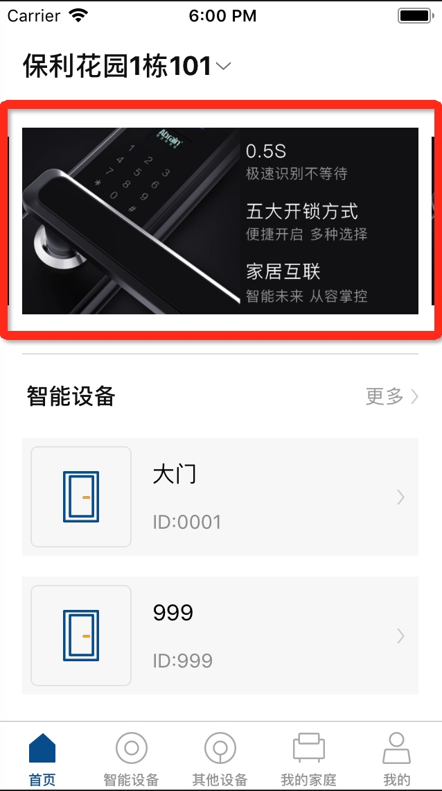

## 我的设备
### 1.缺少修改锁名称接⼝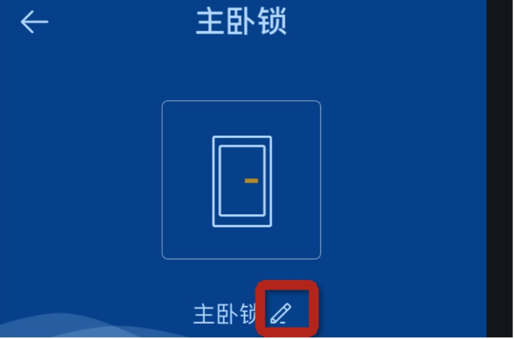

## 我的家庭
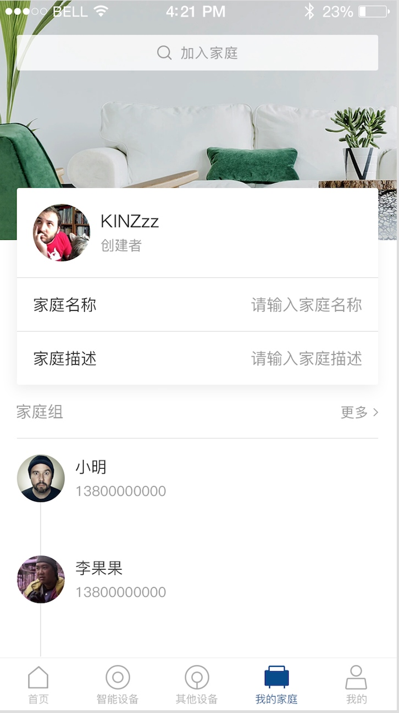
### 1. 家庭顶部图片、家庭名称、家庭描述获取接口。
### 2. 家庭顶部图片修改接口。
### 3. 家庭搜索
### 4. 加入家庭申请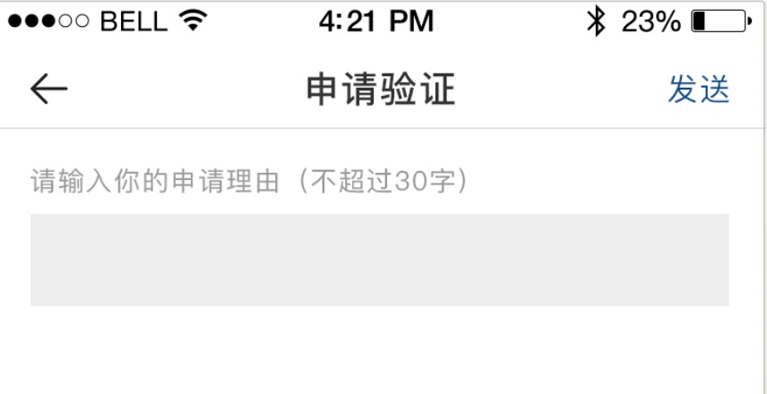
### 5. 添加家庭成员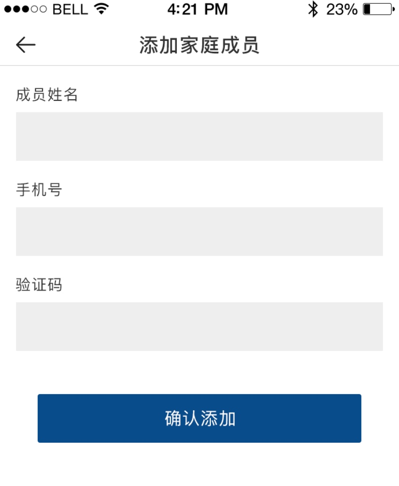

## 个人中心
### 1. 用户密码校验接口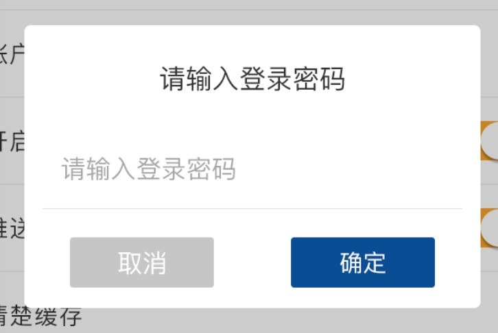

### 2. 关于我们接口或者网络url
### 3. 系统消息接口（列表接口、同意/拒绝家庭申请接口）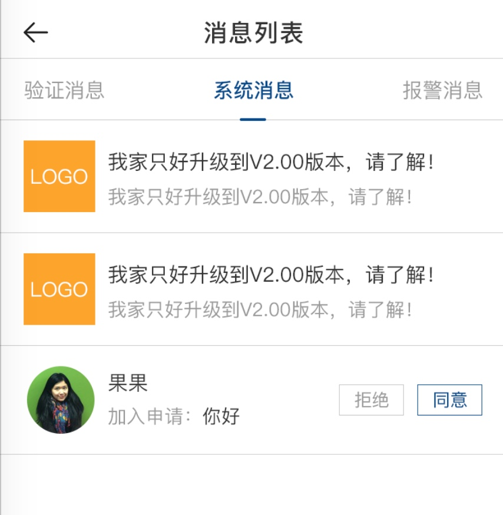
### 4. 报警信息详情接口

### 5. 拍照记录应该锁id为非必填还缺少一些字段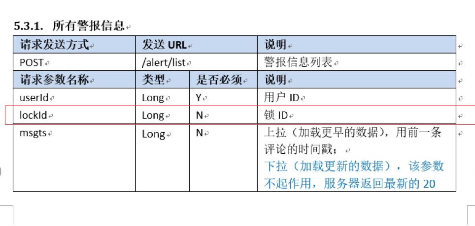
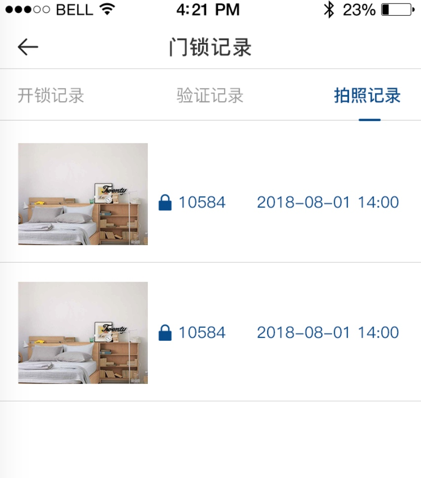

### 6. 所有警报信息接口/alert/list缺少字段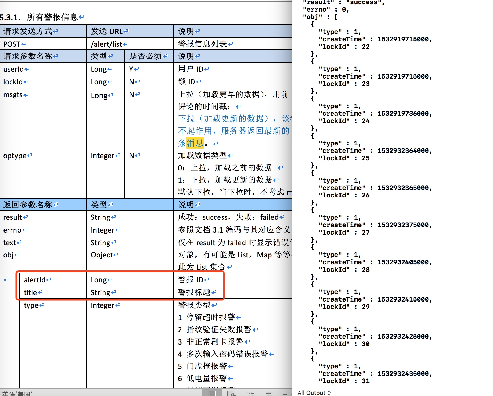

### 7.用户反馈缺少手机字段
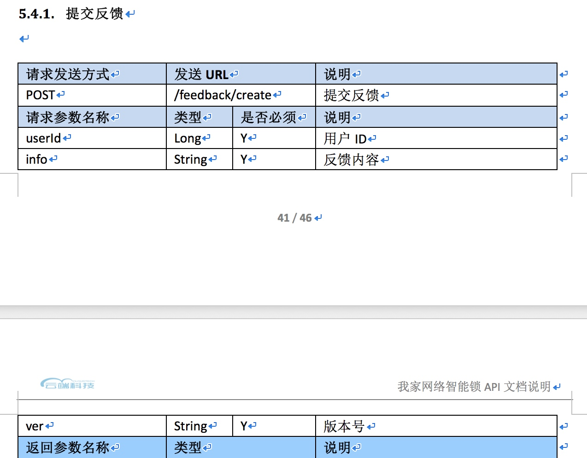
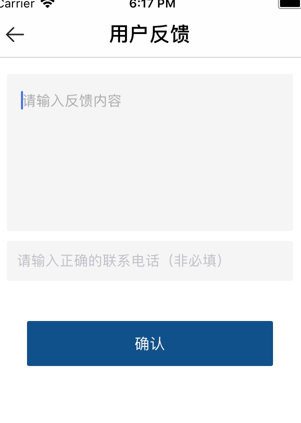

### 8. 缺少常⻅见问题接⼝口

